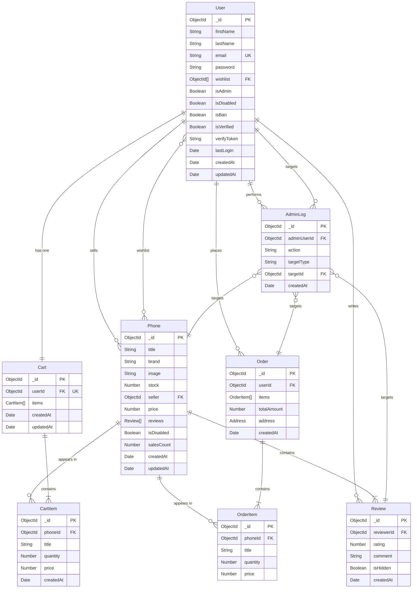

# Database Structure

## Overview

This document describes the database structure for the OldPhoneDeals e-commerce platform.

**Database Type**: MongoDB (NoSQL)
**ODM**: Mongoose
**Connection**: Configured via `MONGODB_URI` environment variable

---

## Entity-Relationship Diagram



---

## Collections Detail

### 1. Users Collection

**Purpose**: Stores user account information and authentication data.

**Schema Location**: `server/app/models/user.js`

| Field | Type | Required | Constraints | Description |
|-------|------|----------|-------------|-------------|
| _id | ObjectId | Auto | Primary Key | Unique identifier |
| firstName | String | Yes | - | User's first name |
| lastName | String | Yes | - | User's last name |
| email | String | Yes | Unique, Lowercase, Regex validated | User's email address |
| password | String | Yes | Bcrypt hashed, select: false | Hashed password |
| wishlist | ObjectId[] | No | References Phone | Array of favorite phones |
| isAdmin | Boolean | No | Default: false | Admin role flag |
| isDisabled | Boolean | No | Default: false | Account disabled flag |
| isBan | Boolean | No | Default: false | Account banned flag |
| isVerified | Boolean | No | Default: false | Email verification status |
| verifyToken | String | No | - | Email verification token |
| lastLogin | Date | No | - | Last login timestamp |
| createdAt | Date | Auto | Default: Date.now | Creation timestamp |
| updatedAt | Date | Auto | Default: Date.now | Last update timestamp |

**Methods**:
- `comparePassword(candidatePassword)`: Validates password against hash

**Hooks**:
- Pre-save: Auto-hashes password using bcrypt (salt rounds: 12)

**Relationships**:
- One-to-One with Cart
- One-to-Many with Order (as buyer)
- One-to-Many with Phone (as seller)
- Many-to-Many with Phone (wishlist)

---

### 2. Phones Collection

**Purpose**: Stores phone product listings.

**Schema Location**: `server/app/models/phone.js`

| Field | Type | Required | Constraints | Description |
|-------|------|----------|-------------|-------------|
| _id | ObjectId | Auto | Primary Key | Unique identifier |
| title | String | Yes | - | Phone title/name |
| brand | String | Yes | Enum: Samsung, Apple, HTC, Huawei, Nokia, LG, Motorola, Sony, BlackBerry | Phone brand |
| image | String | Yes | - | Image file path |
| stock | Number | Yes | Min: 0 | Available quantity |
| seller | ObjectId | Yes | References User | Seller's user ID |
| price | Number | Yes | Min: 0 | Price in dollars |
| reviews | Review[] | No | Embedded sub-documents | Product reviews |
| isDisabled | Boolean | No | Default: false | Product disabled flag |
| salesCount | Number | No | Default: 0 | Total sales count |
| createdAt | Date | Auto | Default: Date.now | Creation timestamp |
| updatedAt | Date | Auto | Default: Date.now | Last update timestamp |

**Virtual Fields**:
- `averageRating`: Calculated from reviews array (read-only)

**Sub-document: Review Schema**:

| Field | Type | Required | Constraints | Description |
|-------|------|----------|-------------|-------------|
| _id | ObjectId | Auto | Primary Key | Review identifier |
| reviewerId | ObjectId | Yes | References User | Reviewer's user ID |
| rating | Number | Yes | Min: 1, Max: 5 | Rating score |
| comment | String | Yes | - | Review text |
| isHidden | Boolean | No | Default: false | Hidden by admin flag |
| createdAt | Date | Auto | Default: Date.now | Creation timestamp |

**Relationships**:
- Many-to-One with User (seller)
- One-to-Many with Review (embedded)
- Many-to-Many with User (wishlist)

---

### 3. Carts Collection

**Purpose**: Stores user shopping carts (one per user).

**Schema Location**: `server/app/models/cart.js`

| Field | Type | Required | Constraints | Description |
|-------|------|----------|-------------|-------------|
| _id | ObjectId | Auto | Primary Key | Unique identifier |
| userId | ObjectId | Yes | References User, Unique | Owner's user ID |
| items | CartItem[] | No | Embedded sub-documents | Cart items |
| createdAt | Date | Auto | Default: Date.now | Creation timestamp |
| updatedAt | Date | Auto | Default: Date.now | Last update timestamp |

**Sub-document: CartItem Schema**:

| Field | Type | Required | Constraints | Description |
|-------|------|----------|-------------|-------------|
| _id | ObjectId | Auto | Primary Key | Item identifier |
| phoneId | ObjectId | Yes | References Phone | Product ID |
| title | String | Yes | - | Product title (cached) |
| quantity | Number | Yes | Min: 1 | Item quantity |
| price | Number | Yes | Min: 0 | Unit price (cached) |
| createdAt | Date | Auto | Default: Date.now | Addition timestamp |

**Hooks**:
- Pre-save: Auto-updates `updatedAt` field

**Relationships**:
- One-to-One with User
- Contains references to Phone via CartItem

---

### 4. Orders Collection

**Purpose**: Stores completed purchase orders.

**Schema Location**: `server/app/models/order.js`

| Field | Type | Required | Constraints | Description |
|-------|------|----------|-------------|-------------|
| _id | ObjectId | Auto | Primary Key | Unique identifier |
| userId | ObjectId | Yes | References User | Buyer's user ID |
| items | OrderItem[] | Yes | Embedded sub-documents | Ordered items |
| totalAmount | Number | Yes | Min: 0 | Total order amount |
| address | Address | Yes | Embedded object | Shipping address |
| createdAt | Date | Auto | Default: Date.now | Order timestamp |

**Embedded: Address Object**:

| Field | Type | Required | Description |
|-------|------|----------|-------------|
| street | String | Yes | Street address |
| city | String | Yes | City name |
| state | String | Yes | State/Province |
| zip | String | Yes | Postal code |
| country | String | Yes | Country name |

**Sub-document: OrderItem Schema**:

| Field | Type | Required | Constraints | Description |
|-------|------|----------|-------------|-------------|
| _id | ObjectId | Auto | Primary Key | Item identifier |
| phoneId | ObjectId | Yes | References Phone | Product ID |
| title | String | Yes | - | Product title (snapshot) |
| quantity | Number | Yes | Min: 1 | Quantity ordered |
| price | Number | Yes | Min: 0 | Unit price (snapshot) |

**Relationships**:
- Many-to-One with User
- Contains references to Phone via OrderItem

---

### 5. AdminLogs Collection

**Purpose**: Audit trail for administrative actions.

**Schema Location**: `server/app/models/adminLog.js`

| Field | Type | Required | Constraints | Description |
|-------|------|----------|-------------|-------------|
| _id | ObjectId | Auto | Primary Key | Unique identifier |
| adminUserId | ObjectId | Yes | References User | Admin who performed action |
| action | String | Yes | Enum (see below) | Action performed |
| targetType | String | Yes | Enum: User, Phone, Review, Order | Entity type affected |
| targetId | ObjectId | Yes | Polymorphic reference | ID of affected entity |
| createdAt | Date | Auto | Default: Date.now | Action timestamp |

**Allowed Actions (Enum)**:
- User actions: `CREATE_USER`, `UPDATE_USER`, `DELETE_USER`, `DISABLE_USER`, `ENABLE_USER`
- Phone actions: `CREATE_PHONE`, `UPDATE_PHONE`, `DELETE_PHONE`, `DISABLE_PHONE`, `ENABLE_PHONE`
- Review actions: `HIDE_REVIEW`, `SHOW_REVIEW`, `DELETE_REVIEW`
- Order actions: `EXPORT_ORDERS`

**Relationships**:
- Many-to-One with User (admin)
- Polymorphic reference to User/Phone/Review/Order (target)

---

## Key Design Patterns

### 1. Embedded Documents (Denormalization)
- **Reviews** are embedded within **Phone** documents for performance
- **CartItem** and **OrderItem** are embedded for atomicity
- **Address** is embedded in **Order** as it's snapshot data

### 2. Reference Pattern (Normalization)
- User, Cart, Order relationships use ObjectId references
- Allows independent querying and updates

### 3. One-to-One Relationship
- Each **User** has exactly one **Cart** (enforced by unique constraint on `userId`)

### 4. Audit Logging
- **AdminLog** tracks all administrative actions
- Uses polymorphic references via `targetType` and `targetId`

### 5. Virtual Fields
- **Phone.averageRating** is calculated dynamically from reviews array
- Reduces data duplication and ensures consistency

### 6. Password Security
- Passwords hashed using **bcrypt** with salt rounds of 12
- Pre-save middleware automatically handles hashing
- Password field excluded from queries by default (`select: false`)

### 7. Soft Deletes
- Uses flags instead of hard deletes:
  - `isDisabled` (User, Phone)
  - `isBan` (User)
  - `isHidden` (Review)
- Preserves data integrity and allows recovery

### 8. Data Caching in Sub-documents
- **CartItem** and **OrderItem** cache `title` and `price` from Phone
- Preserves historical data even if Phone is updated/deleted

---

## Data Initialization

Initial seed data is loaded from:
- `server/data/phonelisting.json` - Phone products
- `server/data/userlist.json` - User accounts

**Initialization Script**: `server/utils/init-db.js`

The script clears all collections and reloads data in development mode.

---

## Indexes

Recommended indexes for performance:

```javascript
// User collection
db.users.createIndex({ email: 1 }, { unique: true })
db.users.createIndex({ isAdmin: 1 })

// Phone collection
db.phones.createIndex({ seller: 1 })
db.phones.createIndex({ brand: 1 })
db.phones.createIndex({ isDisabled: 1 })
db.phones.createIndex({ salesCount: -1 })

// Cart collection
db.carts.createIndex({ userId: 1 }, { unique: true })

// Order collection
db.orders.createIndex({ userId: 1 })
db.orders.createIndex({ createdAt: -1 })

// AdminLog collection
db.adminlogs.createIndex({ adminUserId: 1 })
db.adminlogs.createIndex({ targetType: 1, targetId: 1 })
db.adminlogs.createIndex({ createdAt: -1 })
```

---

## Database Connection

**Configuration File**: `server/server.js:87`

**Environment Variable**: `MONGODB_URI`

**Example Connection String**:
```
mongodb://localhost:27017/oldphonedeals
```

or for MongoDB Atlas:
```
mongodb+srv://<username>:<password>@cluster.mongodb.net/oldphonedeals?retryWrites=true&w=majority
```

---

## Schema Validation

Mongoose provides built-in validation:
- **Required fields**: Enforced at application level
- **Data types**: Strict type checking
- **Enums**: Limited to predefined values
- **Min/Max**: Numeric range validation
- **Regex**: Pattern validation (e.g., email format)
- **Custom validators**: Via Mongoose validators

---

## Future Considerations

1. **Add indexes** as documented above for production performance
2. **Consider sharding** if data volume grows significantly
3. **Add compound indexes** for common query patterns
4. **Implement TTL indexes** for temporary data (e.g., expired verify tokens)
5. **Add full-text search indexes** for product search functionality
6. **Consider separating Reviews** into their own collection if volume grows
7. **Add payment information** to Order schema (currently not implemented)
8. **Add order status tracking** (pending, shipped, delivered, etc.)
9. **Add inventory reservation** system for concurrent order handling
10. **Implement database backup** and disaster recovery procedures

---

## Migration Notes

Currently, the project uses a simple initialization script. For production:
- Consider using **migration tools** like `migrate-mongo`
- Implement **versioned migrations** for schema changes
- Add **rollback capabilities** for failed deployments
- Use **staging environment** for testing migrations

---

*Last Updated: 2025-11-10*
