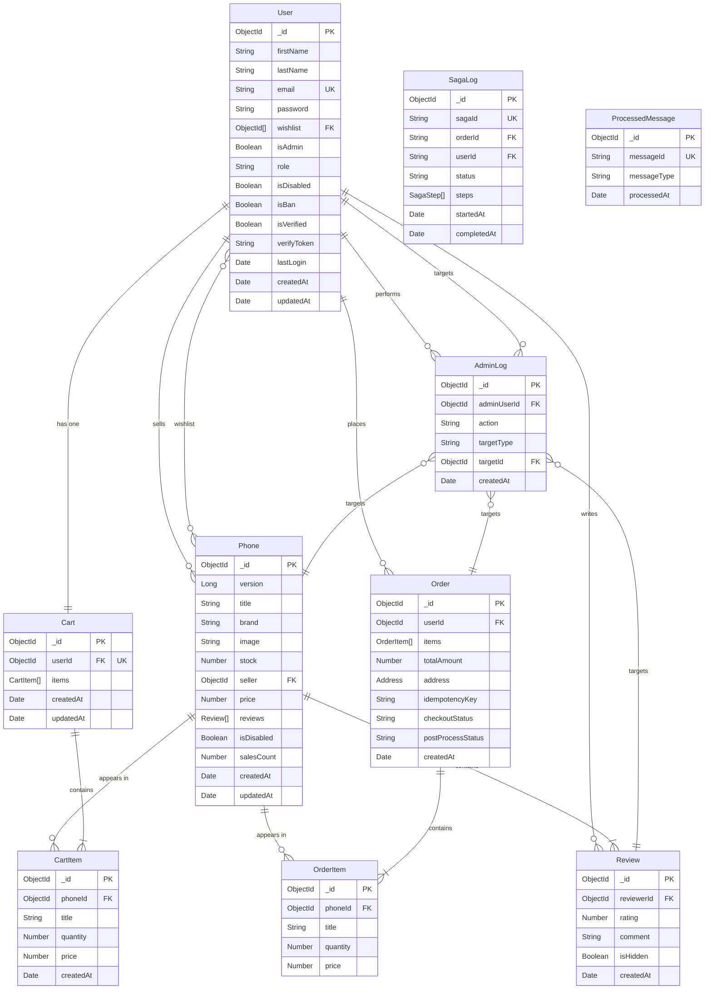

# Database Structure

## Overview

This document describes the database structure for the OldPhoneDeals e-commerce platform.

**Database Type**: MongoDB (NoSQL)
**ODM**: Spring Data MongoDB
**Connection**: Configured via `MONGODB_URI_DEV` / `MONGODB_URI_PROD` environment variables

---

## Entity-Relationship Diagram


```mermaid
erDiagram
    User ||--|| Cart : "has one"
    User ||--o{ Order : "places"
    User ||--o{ Phone : "sells"
    User }o--o{ Phone : "wishlist"
    User ||--o{ Review : "writes"
    User ||--o{ AdminLog : "performs"

    Phone ||--|{ Review : "contains"
    Phone ||--o{ CartItem : "appears in"
    Phone ||--o{ OrderItem : "appears in"

    Cart ||--|{ CartItem : "contains"
    Order ||--|{ OrderItem : "contains"

    AdminLog }o--|| User : "targets"
    AdminLog }o--|| Phone : "targets"
    AdminLog }o--|| Review : "targets"
    AdminLog }o--|| Order : "targets"

    User {
        ObjectId _id PK
        String firstName
        String lastName
        String email UK
        String password
        ObjectId[] wishlist FK
        Boolean isAdmin
        String role
        Boolean isDisabled
        Boolean isBan
        Boolean isVerified
        String verifyToken
        Date lastLogin
        Date createdAt
        Date updatedAt
    }

    Phone {
        ObjectId _id PK
        Long version
        String title
        String brand
        String image
        Number stock
        ObjectId seller FK
        Number price
        Review[] reviews
        Boolean isDisabled
        Number salesCount
        Date createdAt
        Date updatedAt
    }

    Review {
        ObjectId _id PK
        ObjectId reviewerId FK
        Number rating
        String comment
        Boolean isHidden
        Date createdAt
    }

    Cart {
        ObjectId _id PK
        ObjectId userId FK "UK"
        CartItem[] items
        Date createdAt
        Date updatedAt
    }

    CartItem {
        ObjectId _id PK
        ObjectId phoneId FK
        String title
        Number quantity
        Number price
        Date createdAt
    }

    Order {
        ObjectId _id PK
        ObjectId userId FK
        OrderItem[] items
        Number totalAmount
        Address address
        String idempotencyKey
        String checkoutStatus
        String postProcessStatus
        Date createdAt
    }

    OrderItem {
        ObjectId _id PK
        ObjectId phoneId FK
        String title
        Number quantity
        Number price
    }

    AdminLog {
        ObjectId _id PK
        ObjectId adminUserId FK
        String action
        String targetType
        ObjectId targetId FK
        Date createdAt
    }

    SagaLog {
        ObjectId _id PK
        String sagaId UK
        String orderId FK
        String userId FK
        String status
        SagaStep[] steps
        Date startedAt
        Date completedAt
    }

    ProcessedMessage {
        ObjectId _id PK
        String messageId UK
        String messageType
        Date processedAt
    }
```

---

## Collections Detail

### 1. Users Collection

**Purpose**: Stores user account information and authentication data.

**Schema Location**: `spring-old-phone-deals/src/main/java/com/oldphonedeals/entity/User.java`

| Field | Type | Required | Constraints | Description |
|-------|------|----------|-------------|-------------|
| _id | ObjectId | Auto | Primary Key | Unique identifier |
| firstName | String | Yes | - | User's first name |
| lastName | String | Yes | - | User's last name |
| email | String | Yes | Unique | User's email address |
| password | String | Yes | BCrypt hashed | Hashed password |
| wishlist | String[] | No | References Phone | Array of favorite phone IDs |
| isAdmin | Boolean | No | Default: false | Admin role flag |
| role | String | No | Default: "USER" | Role（`USER` / `ADMIN`），已建索引 |
| isDisabled | Boolean | No | Default: false | Account disabled flag |
| isBan | Boolean | No | Default: false | Account banned flag |
| isVerified | Boolean | No | Default: false | Email verification status |
| verifyToken | String | No | - | Email verification token |
| passwordResetCode | String | No | - | 密码重置验证码 |
| passwordResetExpires | Date | No | - | 重置验证码过期时间 |
| lastLogin | Date | No | - | Last login timestamp |
| createdAt | Date | Auto | - | Creation timestamp |
| updatedAt | Date | Auto | - | Last update timestamp |

**Methods**:
- 密码校验与哈希由 `PasswordEncoder`（BCrypt）在 `AuthService` / `ProfileService` 中处理

**Relationships**:
- One-to-One with Cart
- One-to-Many with Order (as buyer)
- One-to-Many with Phone (as seller)
- Many-to-Many with Phone (wishlist)

---

### 2. Phones Collection

**Purpose**: Stores phone product listings.

**Schema Location**: `spring-old-phone-deals/src/main/java/com/oldphonedeals/entity/Phone.java`

| Field | Type | Required | Constraints | Description |
|-------|------|----------|-------------|-------------|
| _id | ObjectId | Auto | Primary Key | Unique identifier |
| version | Long | Auto | Optimistic lock | 乐观锁版本号（`@Version`） |
| title | String | Yes | - | Phone title/name |
| brand | String | Yes | Enum: SAMSUNG, APPLE, HTC, HUAWEI, NOKIA, LG, MOTOROLA, SONY, BLACKBERRY | Phone brand |
| image | String | Yes | - | 图片 URL |
| stock | Number | Yes | Min: 0 | Available quantity |
| seller | ObjectId | Yes | References User | Seller's user ID |
| price | Number | Yes | Min: 0 | Price in dollars |
| reviews | Review[] | No | Embedded sub-documents | Product reviews |
| isDisabled | Boolean | No | Default: false | Product disabled flag |
| salesCount | Number | No | Default: 0 | Total sales count |
| createdAt | Date | Auto | - | Creation timestamp |
| updatedAt | Date | Auto | - | Last update timestamp |

**Virtual Fields**:
- `averageRating`: 由 `getAverageRating()` 从 reviews 动态计算（排除隐藏评论）

**Sub-document: Review Schema**:

| Field | Type | Required | Constraints | Description |
|-------|------|----------|-------------|-------------|
| _id | ObjectId | Auto | Primary Key | Review identifier |
| reviewerId | ObjectId | Yes | References User | Reviewer's user ID |
| rating | Number | Yes | Min: 1, Max: 5 | Rating score |
| comment | String | Yes | - | Review text |
| isHidden | Boolean | No | Default: false | Hidden by admin flag |
| createdAt | Date | Auto | - | Creation timestamp |

**Relationships**:
- Many-to-One with User (seller)
- One-to-Many with Review (embedded)
- Many-to-Many with User (wishlist)

---

### 3. Carts Collection

**Purpose**: Stores user shopping carts (one per user).

**Schema Location**: `spring-old-phone-deals/src/main/java/com/oldphonedeals/entity/Cart.java`

| Field | Type | Required | Constraints | Description |
|-------|------|----------|-------------|-------------|
| _id | ObjectId | Auto | Primary Key | Unique identifier |
| userId | ObjectId | Yes | References User, Unique | Owner's user ID |
| items | CartItem[] | No | Embedded sub-documents | Cart items |
| createdAt | Date | Auto | - | Creation timestamp |
| updatedAt | Date | Auto | - | Last update timestamp |

**Sub-document: CartItem Schema**:

| Field | Type | Required | Constraints | Description |
|-------|------|----------|-------------|-------------|
| _id | ObjectId | Auto | Primary Key | Item identifier |
| phoneId | ObjectId | Yes | References Phone | Product ID |
| title | String | Yes | - | Product title (cached) |
| quantity | Number | Yes | Min: 1 | Item quantity |
| price | Number | Yes | Min: 0 | Unit price (cached) |
| createdAt | Date | Auto | - | Addition timestamp |

**Relationships**:
- One-to-One with User
- Contains references to Phone via CartItem

---

### 4. Orders Collection

**Purpose**: Stores completed purchase orders.

**Schema Location**: `spring-old-phone-deals/src/main/java/com/oldphonedeals/entity/Order.java`

| Field | Type | Required | Constraints | Description |
|-------|------|----------|-------------|-------------|
| _id | ObjectId | Auto | Primary Key | Unique identifier |
| userId | ObjectId | Yes | References User | Buyer's user ID |
| items | OrderItem[] | Yes | Embedded sub-documents | Ordered items |
| totalAmount | Number | Yes | Min: 0 | Total order amount |
| address | Address | Yes | Embedded object | Shipping address |
| idempotencyKey | String | No | Unique with userId | 结账幂等键（防重复下单） |
| checkoutStatus | String | No | Default: PROCESSING | 结账状态（`PROCESSING` / `COMPLETED` / `FAILED`） |
| checkoutError | String | No | - | 结账失败原因 |
| postProcessStatus | String | No | Default: PENDING | 后置处理状态（`PENDING` / `SUCCESS` / `FAILED` / `COMPENSATING` / `COMPENSATED`） |
| postProcessError | String | No | - | 后置处理失败原因 |
| createdAt | Date | Auto | - | Order timestamp |

**Embedded: Address Object**:

| Field | Type | Required | Description |
|-------|------|----------|-------------|
| street | String | Yes | Street address |
| city | String | Yes | City name |
| state | String | Yes | State/Province |
| zip | String | Yes | Postal code |
| country | String | Yes | Country name |

**Sub-document: OrderItem Schema**:

| Field | Type | Required | Constraints | Description |
|-------|------|----------|-------------|-------------|
| _id | ObjectId | Auto | Primary Key | Item identifier |
| phoneId | ObjectId | Yes | References Phone | Product ID |
| title | String | Yes | - | Product title (snapshot) |
| quantity | Number | Yes | Min: 1 | Quantity ordered |
| price | Number | Yes | Min: 0 | Unit price (snapshot) |

**Relationships**:
- Many-to-One with User
- Contains references to Phone via OrderItem

---

### 5. AdminLogs Collection

**Purpose**: Audit trail for administrative actions.

**Schema Location**: `spring-old-phone-deals/src/main/java/com/oldphonedeals/entity/AdminLog.java`

| Field | Type | Required | Constraints | Description |
|-------|------|----------|-------------|-------------|
| _id | ObjectId | Auto | Primary Key | Unique identifier |
| adminUserId | ObjectId | Yes | References User | Admin who performed action |
| action | String | Yes | Enum (see below) | Action performed |
| targetType | String | Yes | Enum: User, Phone, Review, Order | Entity type affected |
| targetId | ObjectId | Yes | Polymorphic reference | ID of affected entity |
| createdAt | Date | Auto | - | Action timestamp |

**Allowed Actions (Enum)**:
- User actions: `CREATE_USER`, `UPDATE_USER`, `DELETE_USER`, `DISABLE_USER`, `ENABLE_USER`
- Phone actions: `CREATE_PHONE`, `UPDATE_PHONE`, `DELETE_PHONE`, `DISABLE_PHONE`, `ENABLE_PHONE`
- Review actions: `HIDE_REVIEW`, `SHOW_REVIEW`, `DELETE_REVIEW`
- Order actions: `EXPORT_ORDERS`

**Relationships**:
- Many-to-One with User (admin)
- Polymorphic reference to User/Phone/Review/Order (target)

---

### 6. SagaLogs Collection

**Purpose**: Saga 补偿流程的审计日志。

**Schema Location**: `spring-old-phone-deals/src/main/java/com/oldphonedeals/entity/SagaLog.java`

| Field | Type | Required | Constraints | Description |
|-------|------|----------|-------------|-------------|
| _id | ObjectId | Auto | Primary Key | Unique identifier |
| sagaId | String | Yes | Unique | Saga 实例标识 |
| orderId | String | Yes | References Order | 关联订单 |
| userId | String | Yes | References User | 关联用户 |
| status | String | Yes | Enum | Saga 整体状态 |
| steps | SagaStep[] | No | Embedded | 各补偿步骤记录 |
| reason | String | No | - | 触发补偿的原因 |
| startedAt | Date | Yes | - | 开始时间 |
| completedAt | Date | No | - | 完成时间 |

**Sub-document: SagaStep**：`stepName`、`status`、`executedAt`、`errorMessage`。

---

### 7. ProcessedMessages Collection

**Purpose**: 消息幂等记录，保证 RabbitMQ 消息不被重复消费。

**Schema Location**: `spring-old-phone-deals/src/main/java/com/oldphonedeals/entity/ProcessedMessage.java`

| Field | Type | Required | Constraints | Description |
|-------|------|----------|-------------|-------------|
| _id | ObjectId | Auto | Primary Key | Unique identifier |
| messageId | String | Yes | Unique | 已处理消息的标识 |
| messageType | String | Yes | - | 消息类型 |
| processedAt | Date | Auto | - | 处理时间 |

---

## Key Design Patterns

### 1. Embedded Documents (Denormalization)
- **Reviews** are embedded within **Phone** documents for performance
- **CartItem** and **OrderItem** are embedded for atomicity
- **Address** is embedded in **Order** as it's snapshot data

### 2. Reference Pattern (Normalization)
- User, Cart, Order relationships use ObjectId references
- Allows independent querying and updates

### 3. One-to-One Relationship
- Each **User** has exactly one **Cart** (enforced by unique constraint on `userId`)

### 4. Audit Logging
- **AdminLog** tracks all administrative actions
- Uses polymorphic references via `targetType` and `targetId`

### 5. Virtual Fields
- **Phone.averageRating** is calculated dynamically from reviews array
- Reduces data duplication and ensures consistency

### 6. Password Security
- Passwords hashed using **BCrypt** with strength 12（见 `PasswordEncoderConfig`）
- 哈希与校验由 `PasswordEncoder` 在 Service 层处理

### 7. Soft Deletes
- Uses flags instead of hard deletes:
  - `isDisabled` (User, Phone)
  - `isBan` (User)
  - `isHidden` (Review)
- Preserves data integrity and allows recovery

### 8. Data Caching in Sub-documents
- **CartItem** and **OrderItem** cache `title` and `price` from Phone
- Preserves historical data even if Phone is updated/deleted

---

## Data Initialization

开发与测试数据由后端 E2E 支持端点按需生成：

- `POST /api/e2e/reset` —— 重置数据库并写入测试用户与商品，仅在 `app.e2e.enabled=true` 时启用（见 `spring-old-phone-deals/src/main/java/com/oldphonedeals/controller/E2eTestController.java`）。

生产 / 开发环境的初始数据需自行导入。

---

## Indexes

后端通过 Spring Data 注解声明索引（`auto-index-creation: true` 时启动自动创建）：

| 集合 | 索引 | 声明位置 |
|------|------|----------|
| `users` | `email`（唯一） | `User.java` `@Indexed(unique = true)` |
| `users` | `role` | `User.java` `@Indexed` |
| `carts` | `userId`（唯一） | `Cart.java` `@Indexed(unique = true)` |
| `orders` | `userId + idempotencyKey`（唯一，部分索引） | `Order.java` `@CompoundIndex` |
| `saga_logs` | `sagaId`（唯一） | `SagaLog.java` `@Indexed(unique = true)` |
| `processed_messages` | `messageId`（唯一） | `ProcessedMessage.java` `@Indexed(unique = true)` |

其他查询字段（`phones.seller`、`phones.brand`、`orders.createdAt` 等）可按需补充复合索引。

---

## Database Connection

**Configuration File**: `spring-old-phone-deals/src/main/resources/application.yml`（默认值）与 `application-dev.yml` / `application-prod.yml`（各环境覆盖）

**Environment Variable**: `MONGODB_URI_DEV`（开发）/ `MONGODB_URI_PROD`（生产）

**Example Connection String**:
```
mongodb://localhost:27017/oldphonedeals
```

or for MongoDB Atlas:
```
mongodb+srv://<username>:<password>@cluster.mongodb.net/oldphonedeals?retryWrites=true&w=majority
```

---

## Schema Validation

Spring Data MongoDB 配合 Bean Validation 提供校验：
- **Required fields**: 通过 `@NotNull` / `@NotBlank` 在请求 DTO 层强制校验
- **Data types**: 实体字段的严格类型映射
- **Enums**: 通过 Java 枚举（如 `PhoneBrand`）限定取值
- **Min/Max**: 数值范围校验
- **Regex**: 格式校验（如邮箱格式）
- **Custom validators**: 自定义校验注解

---

## Future Considerations

1. **Add indexes** as documented above for production performance
2. **Consider sharding** if data volume grows significantly
3. **Add compound indexes** for common query patterns
4. **Implement TTL indexes** for temporary data (e.g., expired verify tokens)
5. **Add full-text search indexes** for product search functionality
6. **Consider separating Reviews** into their own collection if volume grows
7. **Add payment information** to Order schema (currently not implemented)
8. **Add order fulfillment status tracking** (shipped, delivered, etc.)——当前只有结账与后置处理状态
9. **实现数据库备份** 与灾难恢复流程

---

## Migration Notes

当前项目尚未引入版本化迁移工具。若需在生产环境演进 schema：
- 考虑使用 **迁移工具**（如 `mongock`）管理 schema 变更
- 为 schema 变更实现 **版本化迁移**
- 为失败的部署添加 **回滚能力**
- 使用 **staging 环境** 验证迁移

---

*Last Updated: 2026-09-09*
