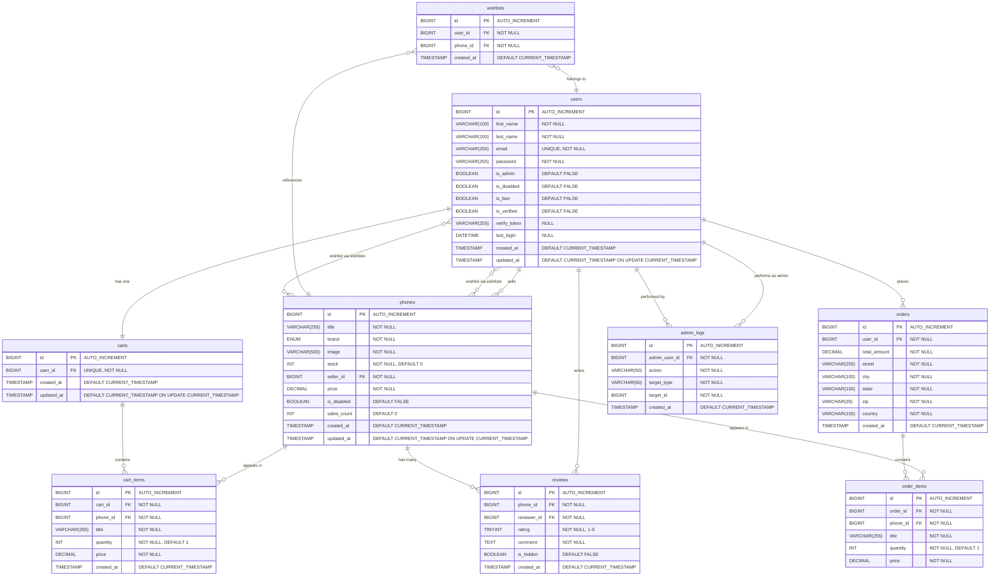

# MySQL Database Structure

## Overview

This document describes the MySQL relational database design converted from the original MongoDB document database for the OldPhoneDeals e-commerce platform.

**Database Type**: MySQL (Relational Database)
**Storage Engine**: InnoDB
**Character Set**: utf8mb4
**Collation**: utf8mb4_unicode_ci

---

## Entity-Relationship Diagram



---

## Database Creation Script

```sql
-- Create database
CREATE DATABASE IF NOT EXISTS oldphonedeals
    CHARACTER SET utf8mb4
    COLLATE utf8mb4_unicode_ci;

USE oldphonedeals;
```

---

## Table Definitions

### 1. users

**Purpose**: Stores user account information and authentication data.

```sql
CREATE TABLE users (
    id BIGINT UNSIGNED AUTO_INCREMENT PRIMARY KEY,
    first_name VARCHAR(100) NOT NULL,
    last_name VARCHAR(100) NOT NULL,
    email VARCHAR(255) NOT NULL UNIQUE,
    password VARCHAR(255) NOT NULL COMMENT 'Bcrypt hashed password',
    is_admin BOOLEAN NOT NULL DEFAULT FALSE,
    is_disabled BOOLEAN NOT NULL DEFAULT FALSE,
    is_ban BOOLEAN NOT NULL DEFAULT FALSE,
    is_verified BOOLEAN NOT NULL DEFAULT FALSE,
    verify_token VARCHAR(255) NULL COMMENT 'Email verification token',
    last_login DATETIME NULL,
    created_at TIMESTAMP DEFAULT CURRENT_TIMESTAMP,
    updated_at TIMESTAMP DEFAULT CURRENT_TIMESTAMP ON UPDATE CURRENT_TIMESTAMP,

    INDEX idx_email (email),
    INDEX idx_is_admin (is_admin),
    INDEX idx_created_at (created_at)
) ENGINE=InnoDB DEFAULT CHARSET=utf8mb4 COLLATE=utf8mb4_unicode_ci
COMMENT='User accounts and authentication';
```

**Field Details**:

| Column | Type | Constraints | Description |
|--------|------|-------------|-------------|
| id | BIGINT UNSIGNED | PK, AUTO_INCREMENT | Unique user identifier |
| first_name | VARCHAR(100) | NOT NULL | User's first name |
| last_name | VARCHAR(100) | NOT NULL | User's last name |
| email | VARCHAR(255) | UNIQUE, NOT NULL | User's email (login credential) |
| password | VARCHAR(255) | NOT NULL | Bcrypt hashed password |
| is_admin | BOOLEAN | DEFAULT FALSE | Admin role flag |
| is_disabled | BOOLEAN | DEFAULT FALSE | Account disabled status |
| is_ban | BOOLEAN | DEFAULT FALSE | Account banned status |
| is_verified | BOOLEAN | DEFAULT FALSE | Email verification status |
| verify_token | VARCHAR(255) | NULL | Email verification token |
| last_login | DATETIME | NULL | Last login timestamp |
| created_at | TIMESTAMP | AUTO | Account creation time |
| updated_at | TIMESTAMP | AUTO | Last update time |

---

### 2. phones

**Purpose**: Stores phone product listings.

```sql
CREATE TABLE phones (
    id BIGINT UNSIGNED AUTO_INCREMENT PRIMARY KEY,
    title VARCHAR(255) NOT NULL,
    brand ENUM('Samsung', 'Apple', 'HTC', 'Huawei', 'Nokia', 'LG', 'Motorola', 'Sony', 'BlackBerry') NOT NULL,
    image VARCHAR(500) NOT NULL COMMENT 'Image file path or URL',
    stock INT UNSIGNED NOT NULL DEFAULT 0,
    seller_id BIGINT UNSIGNED NOT NULL,
    price DECIMAL(10, 2) NOT NULL CHECK (price >= 0),
    is_disabled BOOLEAN NOT NULL DEFAULT FALSE,
    sales_count INT UNSIGNED NOT NULL DEFAULT 0,
    created_at TIMESTAMP DEFAULT CURRENT_TIMESTAMP,
    updated_at TIMESTAMP DEFAULT CURRENT_TIMESTAMP ON UPDATE CURRENT_TIMESTAMP,

    FOREIGN KEY fk_phones_seller (seller_id)
        REFERENCES users(id)
        ON DELETE CASCADE
        ON UPDATE CASCADE,

    INDEX idx_seller (seller_id),
    INDEX idx_brand (brand),
    INDEX idx_is_disabled (is_disabled),
    INDEX idx_sales_count (sales_count DESC),
    INDEX idx_created_at (created_at DESC)
) ENGINE=InnoDB DEFAULT CHARSET=utf8mb4 COLLATE=utf8mb4_unicode_ci
COMMENT='Phone product catalog';
```

**Field Details**:

| Column | Type | Constraints | Description |
|--------|------|-------------|-------------|
| id | BIGINT UNSIGNED | PK, AUTO_INCREMENT | Unique phone identifier |
| title | VARCHAR(255) | NOT NULL | Phone title/name |
| brand | ENUM | NOT NULL | Phone brand (9 options) |
| image | VARCHAR(500) | NOT NULL | Image path or URL |
| stock | INT UNSIGNED | NOT NULL, >= 0 | Available inventory |
| seller_id | BIGINT UNSIGNED | FK to users, NOT NULL | Seller user ID |
| price | DECIMAL(10,2) | NOT NULL, >= 0 | Product price |
| is_disabled | BOOLEAN | DEFAULT FALSE | Disabled by admin flag |
| sales_count | INT UNSIGNED | DEFAULT 0 | Total sales count |
| created_at | TIMESTAMP | AUTO | Creation time |
| updated_at | TIMESTAMP | AUTO | Last update time |

---

### 3. reviews

**Purpose**: Stores product reviews (normalized from embedded documents).

```sql
CREATE TABLE reviews (
    id BIGINT UNSIGNED AUTO_INCREMENT PRIMARY KEY,
    phone_id BIGINT UNSIGNED NOT NULL,
    reviewer_id BIGINT UNSIGNED NOT NULL,
    rating TINYINT UNSIGNED NOT NULL CHECK (rating BETWEEN 1 AND 5),
    comment TEXT NOT NULL,
    is_hidden BOOLEAN NOT NULL DEFAULT FALSE COMMENT 'Hidden by admin',
    created_at TIMESTAMP DEFAULT CURRENT_TIMESTAMP,

    FOREIGN KEY fk_reviews_phone (phone_id)
        REFERENCES phones(id)
        ON DELETE CASCADE
        ON UPDATE CASCADE,

    FOREIGN KEY fk_reviews_reviewer (reviewer_id)
        REFERENCES users(id)
        ON DELETE CASCADE
        ON UPDATE CASCADE,

    INDEX idx_phone (phone_id),
    INDEX idx_reviewer (reviewer_id),
    INDEX idx_created_at (created_at DESC),
    INDEX idx_is_hidden (is_hidden),

    -- Prevent duplicate reviews from same user on same phone
    UNIQUE KEY uk_phone_reviewer (phone_id, reviewer_id)
) ENGINE=InnoDB DEFAULT CHARSET=utf8mb4 COLLATE=utf8mb4_unicode_ci
COMMENT='Product reviews and ratings';
```

**Field Details**:

| Column | Type | Constraints | Description |
|--------|------|-------------|-------------|
| id | BIGINT UNSIGNED | PK, AUTO_INCREMENT | Unique review identifier |
| phone_id | BIGINT UNSIGNED | FK to phones, NOT NULL | Reviewed phone |
| reviewer_id | BIGINT UNSIGNED | FK to users, NOT NULL | Review author |
| rating | TINYINT UNSIGNED | 1-5, NOT NULL | Star rating |
| comment | TEXT | NOT NULL | Review text |
| is_hidden | BOOLEAN | DEFAULT FALSE | Admin hide flag |
| created_at | TIMESTAMP | AUTO | Review timestamp |

**Constraints**:
- One review per user per phone (UNIQUE KEY)

---

### 4. carts

**Purpose**: Stores shopping carts (one per user).

```sql
CREATE TABLE carts (
    id BIGINT UNSIGNED AUTO_INCREMENT PRIMARY KEY,
    user_id BIGINT UNSIGNED NOT NULL UNIQUE,
    created_at TIMESTAMP DEFAULT CURRENT_TIMESTAMP,
    updated_at TIMESTAMP DEFAULT CURRENT_TIMESTAMP ON UPDATE CURRENT_TIMESTAMP,

    FOREIGN KEY fk_carts_user (user_id)
        REFERENCES users(id)
        ON DELETE CASCADE
        ON UPDATE CASCADE,

    INDEX idx_user (user_id)
) ENGINE=InnoDB DEFAULT CHARSET=utf8mb4 COLLATE=utf8mb4_unicode_ci
COMMENT='User shopping carts';
```

**Field Details**:

| Column | Type | Constraints | Description |
|--------|------|-------------|-------------|
| id | BIGINT UNSIGNED | PK, AUTO_INCREMENT | Unique cart identifier |
| user_id | BIGINT UNSIGNED | FK to users, UNIQUE, NOT NULL | Cart owner |
| created_at | TIMESTAMP | AUTO | Creation time |
| updated_at | TIMESTAMP | AUTO | Last update time |

**Constraints**:
- One cart per user (UNIQUE on user_id)

---

### 5. cart_items

**Purpose**: Stores items in shopping carts (normalized from embedded documents).

```sql
CREATE TABLE cart_items (
    id BIGINT UNSIGNED AUTO_INCREMENT PRIMARY KEY,
    cart_id BIGINT UNSIGNED NOT NULL,
    phone_id BIGINT UNSIGNED NOT NULL,
    title VARCHAR(255) NOT NULL COMMENT 'Cached phone title',
    quantity INT UNSIGNED NOT NULL DEFAULT 1 CHECK (quantity > 0),
    price DECIMAL(10, 2) NOT NULL CHECK (price >= 0) COMMENT 'Cached unit price',
    created_at TIMESTAMP DEFAULT CURRENT_TIMESTAMP,

    FOREIGN KEY fk_cart_items_cart (cart_id)
        REFERENCES carts(id)
        ON DELETE CASCADE
        ON UPDATE CASCADE,

    FOREIGN KEY fk_cart_items_phone (phone_id)
        REFERENCES phones(id)
        ON DELETE CASCADE
        ON UPDATE CASCADE,

    INDEX idx_cart (cart_id),
    INDEX idx_phone (phone_id),

    -- Prevent duplicate items in same cart
    UNIQUE KEY uk_cart_phone (cart_id, phone_id)
) ENGINE=InnoDB DEFAULT CHARSET=utf8mb4 COLLATE=utf8mb4_unicode_ci
COMMENT='Shopping cart items';
```

**Field Details**:

| Column | Type | Constraints | Description |
|--------|------|-------------|-------------|
| id | BIGINT UNSIGNED | PK, AUTO_INCREMENT | Unique item identifier |
| cart_id | BIGINT UNSIGNED | FK to carts, NOT NULL | Parent cart |
| phone_id | BIGINT UNSIGNED | FK to phones, NOT NULL | Product reference |
| title | VARCHAR(255) | NOT NULL | Cached product title |
| quantity | INT UNSIGNED | > 0, DEFAULT 1 | Item quantity |
| price | DECIMAL(10,2) | >= 0, NOT NULL | Cached unit price |
| created_at | TIMESTAMP | AUTO | Addition time |

**Constraints**:
- One phone per cart (UNIQUE KEY on cart_id, phone_id)

---

### 6. orders

**Purpose**: Stores completed purchase orders.

```sql
CREATE TABLE orders (
    id BIGINT UNSIGNED AUTO_INCREMENT PRIMARY KEY,
    user_id BIGINT UNSIGNED NOT NULL,
    total_amount DECIMAL(10, 2) NOT NULL CHECK (total_amount >= 0),
    street VARCHAR(255) NOT NULL,
    city VARCHAR(100) NOT NULL,
    state VARCHAR(100) NOT NULL,
    zip VARCHAR(20) NOT NULL,
    country VARCHAR(100) NOT NULL,
    created_at TIMESTAMP DEFAULT CURRENT_TIMESTAMP,

    FOREIGN KEY fk_orders_user (user_id)
        REFERENCES users(id)
        ON DELETE CASCADE
        ON UPDATE CASCADE,

    INDEX idx_user (user_id),
    INDEX idx_created_at (created_at DESC)
) ENGINE=InnoDB DEFAULT CHARSET=utf8mb4 COLLATE=utf8mb4_unicode_ci
COMMENT='Customer purchase orders';
```

**Field Details**:

| Column | Type | Constraints | Description |
|--------|------|-------------|-------------|
| id | BIGINT UNSIGNED | PK, AUTO_INCREMENT | Unique order identifier |
| user_id | BIGINT UNSIGNED | FK to users, NOT NULL | Buyer user ID |
| total_amount | DECIMAL(10,2) | >= 0, NOT NULL | Total order amount |
| street | VARCHAR(255) | NOT NULL | Shipping street address |
| city | VARCHAR(100) | NOT NULL | Shipping city |
| state | VARCHAR(100) | NOT NULL | Shipping state/province |
| zip | VARCHAR(20) | NOT NULL | Shipping postal code |
| country | VARCHAR(100) | NOT NULL | Shipping country |
| created_at | TIMESTAMP | AUTO | Order timestamp |

**Note**: Address fields are denormalized for historical snapshot.

---

### 7. order_items

**Purpose**: Stores items in completed orders (normalized from embedded documents).

```sql
CREATE TABLE order_items (
    id BIGINT UNSIGNED AUTO_INCREMENT PRIMARY KEY,
    order_id BIGINT UNSIGNED NOT NULL,
    phone_id BIGINT UNSIGNED NOT NULL,
    title VARCHAR(255) NOT NULL COMMENT 'Snapshot of phone title',
    quantity INT UNSIGNED NOT NULL DEFAULT 1 CHECK (quantity > 0),
    price DECIMAL(10, 2) NOT NULL CHECK (price >= 0) COMMENT 'Snapshot of unit price',

    FOREIGN KEY fk_order_items_order (order_id)
        REFERENCES orders(id)
        ON DELETE CASCADE
        ON UPDATE CASCADE,

    FOREIGN KEY fk_order_items_phone (phone_id)
        REFERENCES phones(id)
        ON DELETE RESTRICT
        ON UPDATE CASCADE,

    INDEX idx_order (order_id),
    INDEX idx_phone (phone_id)
) ENGINE=InnoDB DEFAULT CHARSET=utf8mb4 COLLATE=utf8mb4_unicode_ci
COMMENT='Order line items';
```

**Field Details**:

| Column | Type | Constraints | Description |
|--------|------|-------------|-------------|
| id | BIGINT UNSIGNED | PK, AUTO_INCREMENT | Unique item identifier |
| order_id | BIGINT UNSIGNED | FK to orders, NOT NULL | Parent order |
| phone_id | BIGINT UNSIGNED | FK to phones, NOT NULL | Product reference |
| title | VARCHAR(255) | NOT NULL | Snapshot of title |
| quantity | INT UNSIGNED | > 0, DEFAULT 1 | Quantity ordered |
| price | DECIMAL(10,2) | >= 0, NOT NULL | Snapshot of price |

**Note**:
- Uses `ON DELETE RESTRICT` for phones to prevent deletion of products in historical orders
- Title and price are snapshots at time of order

---

### 8. wishlists

**Purpose**: Junction table for many-to-many relationship between users and phones.

```sql
CREATE TABLE wishlists (
    id BIGINT UNSIGNED AUTO_INCREMENT PRIMARY KEY,
    user_id BIGINT UNSIGNED NOT NULL,
    phone_id BIGINT UNSIGNED NOT NULL,
    created_at TIMESTAMP DEFAULT CURRENT_TIMESTAMP,

    FOREIGN KEY fk_wishlists_user (user_id)
        REFERENCES users(id)
        ON DELETE CASCADE
        ON UPDATE CASCADE,

    FOREIGN KEY fk_wishlists_phone (phone_id)
        REFERENCES phones(id)
        ON DELETE CASCADE
        ON UPDATE CASCADE,

    INDEX idx_user (user_id),
    INDEX idx_phone (phone_id),
    INDEX idx_created_at (created_at DESC),

    -- Prevent duplicate wishlist entries
    UNIQUE KEY uk_user_phone (user_id, phone_id)
) ENGINE=InnoDB DEFAULT CHARSET=utf8mb4 COLLATE=utf8mb4_unicode_ci
COMMENT='User wishlist items';
```

**Field Details**:

| Column | Type | Constraints | Description |
|--------|------|-------------|-------------|
| id | BIGINT UNSIGNED | PK, AUTO_INCREMENT | Unique entry identifier |
| user_id | BIGINT UNSIGNED | FK to users, NOT NULL | User who wishlisted |
| phone_id | BIGINT UNSIGNED | FK to phones, NOT NULL | Wishlisted phone |
| created_at | TIMESTAMP | AUTO | Addition timestamp |

**Constraints**:
- One phone per user wishlist (UNIQUE KEY)

---

### 9. admin_logs

**Purpose**: Audit trail for administrative actions.

```sql
CREATE TABLE admin_logs (
    id BIGINT UNSIGNED AUTO_INCREMENT PRIMARY KEY,
    admin_user_id BIGINT UNSIGNED NOT NULL,
    action VARCHAR(50) NOT NULL,
    target_type VARCHAR(50) NOT NULL,
    target_id BIGINT UNSIGNED NOT NULL,
    created_at TIMESTAMP DEFAULT CURRENT_TIMESTAMP,

    FOREIGN KEY fk_admin_logs_admin (admin_user_id)
        REFERENCES users(id)
        ON DELETE CASCADE
        ON UPDATE CASCADE,

    INDEX idx_admin_user (admin_user_id),
    INDEX idx_target (target_type, target_id),
    INDEX idx_action (action),
    INDEX idx_created_at (created_at DESC),

    CHECK (action IN (
        'CREATE_USER', 'UPDATE_USER', 'DELETE_USER', 'DISABLE_USER', 'ENABLE_USER',
        'CREATE_PHONE', 'UPDATE_PHONE', 'DELETE_PHONE', 'DISABLE_PHONE', 'ENABLE_PHONE',
        'HIDE_REVIEW', 'SHOW_REVIEW', 'DELETE_REVIEW',
        'EXPORT_ORDERS'
    )),

    CHECK (target_type IN ('User', 'Phone', 'Review', 'Order'))
) ENGINE=InnoDB DEFAULT CHARSET=utf8mb4 COLLATE=utf8mb4_unicode_ci
COMMENT='Administrative action audit log';
```

**Field Details**:

| Column | Type | Constraints | Description |
|--------|------|-------------|-------------|
| id | BIGINT UNSIGNED | PK, AUTO_INCREMENT | Unique log identifier |
| admin_user_id | BIGINT UNSIGNED | FK to users, NOT NULL | Admin who acted |
| action | VARCHAR(50) | ENUM check, NOT NULL | Action performed |
| target_type | VARCHAR(50) | ENUM check, NOT NULL | Entity type |
| target_id | BIGINT UNSIGNED | NOT NULL | Entity ID |
| created_at | TIMESTAMP | AUTO | Action timestamp |

**Allowed Actions**:
- User: CREATE_USER, UPDATE_USER, DELETE_USER, DISABLE_USER, ENABLE_USER
- Phone: CREATE_PHONE, UPDATE_PHONE, DELETE_PHONE, DISABLE_PHONE, ENABLE_PHONE
- Review: HIDE_REVIEW, SHOW_REVIEW, DELETE_REVIEW
- Order: EXPORT_ORDERS

---

## Views

### View: phone_ratings

**Purpose**: Pre-calculated average ratings for phones.

```sql
CREATE VIEW phone_ratings AS
SELECT
    p.id AS phone_id,
    p.title,
    COUNT(r.id) AS review_count,
    COALESCE(AVG(r.rating), 0) AS average_rating
FROM phones p
LEFT JOIN reviews r ON p.id = r.phone_id AND r.is_hidden = FALSE
GROUP BY p.id, p.title;
```

**Usage**:
```sql
-- Get phone with average rating
SELECT
    p.*,
    pr.review_count,
    pr.average_rating
FROM phones p
LEFT JOIN phone_ratings pr ON p.id = pr.phone_id;
```

---

### View: cart_summary

**Purpose**: Shopping cart totals for each user.

```sql
CREATE VIEW cart_summary AS
SELECT
    c.id AS cart_id,
    c.user_id,
    COUNT(ci.id) AS item_count,
    COALESCE(SUM(ci.quantity), 0) AS total_quantity,
    COALESCE(SUM(ci.quantity * ci.price), 0) AS total_amount
FROM carts c
LEFT JOIN cart_items ci ON c.id = ci.cart_id
GROUP BY c.id, c.user_id;
```

---

### View: user_statistics

**Purpose**: User purchase and review statistics.

```sql
CREATE VIEW user_statistics AS
SELECT
    u.id AS user_id,
    u.email,
    COUNT(DISTINCT o.id) AS order_count,
    COALESCE(SUM(o.total_amount), 0) AS total_spent,
    COUNT(DISTINCT r.id) AS review_count,
    COUNT(DISTINCT w.phone_id) AS wishlist_count
FROM users u
LEFT JOIN orders o ON u.id = o.user_id
LEFT JOIN reviews r ON u.id = r.reviewer_id
LEFT JOIN wishlists w ON u.id = w.user_id
GROUP BY u.id, u.email;
```

---

## Stored Procedures

### Procedure: add_to_cart

**Purpose**: Safely add item to cart with quantity update if exists.

```sql
DELIMITER //

CREATE PROCEDURE add_to_cart(
    IN p_user_id BIGINT UNSIGNED,
    IN p_phone_id BIGINT UNSIGNED,
    IN p_quantity INT UNSIGNED
)
BEGIN
    DECLARE v_cart_id BIGINT UNSIGNED;
    DECLARE v_phone_title VARCHAR(255);
    DECLARE v_phone_price DECIMAL(10,2);

    -- Start transaction
    START TRANSACTION;

    -- Get or create cart
    SELECT id INTO v_cart_id FROM carts WHERE user_id = p_user_id;

    IF v_cart_id IS NULL THEN
        INSERT INTO carts (user_id) VALUES (p_user_id);
        SET v_cart_id = LAST_INSERT_ID();
    END IF;

    -- Get phone details
    SELECT title, price INTO v_phone_title, v_phone_price
    FROM phones
    WHERE id = p_phone_id AND is_disabled = FALSE;

    IF v_phone_title IS NULL THEN
        SIGNAL SQLSTATE '45000' SET MESSAGE_TEXT = 'Phone not found or disabled';
    END IF;

    -- Insert or update cart item
    INSERT INTO cart_items (cart_id, phone_id, title, quantity, price)
    VALUES (v_cart_id, p_phone_id, v_phone_title, p_quantity, v_phone_price)
    ON DUPLICATE KEY UPDATE
        quantity = quantity + p_quantity,
        price = v_phone_price;

    COMMIT;
END //

DELIMITER ;
```

---

### Procedure: create_order_from_cart

**Purpose**: Create order from cart and clear cart.

```sql
DELIMITER //

CREATE PROCEDURE create_order_from_cart(
    IN p_user_id BIGINT UNSIGNED,
    IN p_street VARCHAR(255),
    IN p_city VARCHAR(100),
    IN p_state VARCHAR(100),
    IN p_zip VARCHAR(20),
    IN p_country VARCHAR(100),
    OUT p_order_id BIGINT UNSIGNED
)
BEGIN
    DECLARE v_cart_id BIGINT UNSIGNED;
    DECLARE v_total_amount DECIMAL(10,2);

    -- Start transaction
    START TRANSACTION;

    -- Get cart
    SELECT id INTO v_cart_id FROM carts WHERE user_id = p_user_id;

    IF v_cart_id IS NULL THEN
        SIGNAL SQLSTATE '45000' SET MESSAGE_TEXT = 'Cart not found';
    END IF;

    -- Calculate total
    SELECT SUM(quantity * price) INTO v_total_amount
    FROM cart_items
    WHERE cart_id = v_cart_id;

    IF v_total_amount IS NULL OR v_total_amount = 0 THEN
        SIGNAL SQLSTATE '45000' SET MESSAGE_TEXT = 'Cart is empty';
    END IF;

    -- Create order
    INSERT INTO orders (user_id, total_amount, street, city, state, zip, country)
    VALUES (p_user_id, v_total_amount, p_street, p_city, p_state, p_zip, p_country);

    SET p_order_id = LAST_INSERT_ID();

    -- Copy cart items to order items
    INSERT INTO order_items (order_id, phone_id, title, quantity, price)
    SELECT p_order_id, phone_id, title, quantity, price
    FROM cart_items
    WHERE cart_id = v_cart_id;

    -- Update sales count
    UPDATE phones p
    INNER JOIN cart_items ci ON p.id = ci.phone_id
    SET p.sales_count = p.sales_count + ci.quantity,
        p.stock = p.stock - ci.quantity
    WHERE ci.cart_id = v_cart_id;

    -- Clear cart
    DELETE FROM cart_items WHERE cart_id = v_cart_id;

    COMMIT;
END //

DELIMITER ;
```

---

### Procedure: calculate_phone_average_rating

**Purpose**: Calculate average rating for a phone.

```sql
DELIMITER //

CREATE PROCEDURE calculate_phone_average_rating(
    IN p_phone_id BIGINT UNSIGNED,
    OUT p_average_rating DECIMAL(3,2),
    OUT p_review_count INT
)
BEGIN
    SELECT
        COALESCE(AVG(rating), 0),
        COUNT(id)
    INTO p_average_rating, p_review_count
    FROM reviews
    WHERE phone_id = p_phone_id AND is_hidden = FALSE;
END //

DELIMITER ;
```

---

## Triggers

### Trigger: before_cart_items_insert

**Purpose**: Validate stock availability before adding to cart.

```sql
DELIMITER //

CREATE TRIGGER before_cart_items_insert
BEFORE INSERT ON cart_items
FOR EACH ROW
BEGIN
    DECLARE v_stock INT UNSIGNED;

    SELECT stock INTO v_stock FROM phones WHERE id = NEW.phone_id;

    IF v_stock < NEW.quantity THEN
        SIGNAL SQLSTATE '45000'
        SET MESSAGE_TEXT = 'Insufficient stock';
    END IF;
END //

DELIMITER ;
```

---

### Trigger: after_review_insert

**Purpose**: Log review creation timestamp.

```sql
DELIMITER //

CREATE TRIGGER after_review_insert
AFTER INSERT ON reviews
FOR EACH ROW
BEGIN
    -- Could trigger notification or analytics here
    -- For now, just ensure data consistency
    UPDATE phones
    SET updated_at = CURRENT_TIMESTAMP
    WHERE id = NEW.phone_id;
END //

DELIMITER ;
```

---

## Key Differences from MongoDB Design

### 1. Normalization

**MongoDB** (Embedded Documents):
- Reviews embedded in Phone documents
- CartItems embedded in Cart documents
- OrderItems embedded in Order documents

**MySQL** (Normalized Tables):
- Reviews in separate `reviews` table with FK to `phones`
- CartItems in separate `cart_items` table with FK to `carts`
- OrderItems in separate `order_items` table with FK to `orders`

---

### 2. Many-to-Many Relationships

**MongoDB**:
- Wishlist as array of ObjectIds in User document

**MySQL**:
- Separate `wishlists` junction table with FKs to both `users` and `phones`

---

### 3. Data Types

| MongoDB | MySQL |
|---------|-------|
| ObjectId | BIGINT UNSIGNED AUTO_INCREMENT |
| String | VARCHAR / TEXT |
| Number | INT / BIGINT / DECIMAL |
| Boolean | BOOLEAN (TINYINT(1)) |
| Date | TIMESTAMP / DATETIME |
| Array | Separate table with FK |
| Embedded Object | Denormalized columns or separate table |

---

### 4. Constraints

**MySQL Advantages**:
- Foreign key constraints ensure referential integrity
- CHECK constraints validate data ranges
- UNIQUE constraints prevent duplicates
- CASCADE actions automate cleanup

**MongoDB Approach**:
- Application-level validation
- No built-in foreign key constraints
- Relies on application logic for integrity

---

### 5. Queries

**Average Rating**:

MongoDB:
```javascript
db.phones.aggregate([
  { $unwind: "$reviews" },
  { $group: { _id: "$_id", avgRating: { $avg: "$reviews.rating" } } }
])
```

MySQL:
```sql
SELECT phone_id, AVG(rating) as avg_rating
FROM reviews
WHERE is_hidden = FALSE
GROUP BY phone_id;
```

---

### 6. Performance Optimization

**MongoDB**:
- Embedding for read performance (fewer joins)
- Denormalization strategy
- Document-level atomicity

**MySQL**:
- Indexes on foreign keys and query columns
- Views for complex aggregations
- Stored procedures for business logic
- JOIN operations across normalized tables

---

## Indexes Summary

```sql
-- users
CREATE INDEX idx_users_email ON users(email);
CREATE INDEX idx_users_is_admin ON users(is_admin);

-- phones
CREATE INDEX idx_phones_seller ON phones(seller_id);
CREATE INDEX idx_phones_brand ON phones(brand);
CREATE INDEX idx_phones_sales ON phones(sales_count DESC);

-- reviews
CREATE INDEX idx_reviews_phone ON reviews(phone_id);
CREATE INDEX idx_reviews_reviewer ON reviews(reviewer_id);

-- cart_items
CREATE INDEX idx_cart_items_cart ON cart_items(cart_id);
CREATE INDEX idx_cart_items_phone ON cart_items(phone_id);

-- order_items
CREATE INDEX idx_order_items_order ON order_items(order_id);
CREATE INDEX idx_order_items_phone ON order_items(phone_id);

-- wishlists
CREATE INDEX idx_wishlists_user ON wishlists(user_id);
CREATE INDEX idx_wishlists_phone ON wishlists(phone_id);

-- admin_logs
CREATE INDEX idx_admin_logs_admin ON admin_logs(admin_user_id);
CREATE INDEX idx_admin_logs_target ON admin_logs(target_type, target_id);
CREATE INDEX idx_admin_logs_created ON admin_logs(created_at DESC);
```

---

## Sample Queries

### Get phone with average rating

```sql
SELECT
    p.id,
    p.title,
    p.brand,
    p.price,
    p.stock,
    COUNT(r.id) AS review_count,
    COALESCE(AVG(r.rating), 0) AS average_rating
FROM phones p
LEFT JOIN reviews r ON p.id = r.phone_id AND r.is_hidden = FALSE
WHERE p.is_disabled = FALSE
GROUP BY p.id, p.title, p.brand, p.price, p.stock;
```

---

### Get user's cart with items

```sql
SELECT
    u.id AS user_id,
    u.email,
    c.id AS cart_id,
    ci.id AS item_id,
    ci.title,
    ci.quantity,
    ci.price,
    (ci.quantity * ci.price) AS subtotal
FROM users u
INNER JOIN carts c ON u.id = c.user_id
INNER JOIN cart_items ci ON c.id = ci.cart_id
WHERE u.id = ?;
```

---

### Get user's order history

```sql
SELECT
    o.id AS order_id,
    o.created_at,
    o.total_amount,
    COUNT(oi.id) AS item_count,
    o.street,
    o.city,
    o.state,
    o.zip,
    o.country
FROM orders o
INNER JOIN order_items oi ON o.id = oi.order_id
WHERE o.user_id = ?
GROUP BY o.id, o.created_at, o.total_amount, o.street, o.city, o.state, o.zip, o.country
ORDER BY o.created_at DESC;
```

---

### Get top-selling phones

```sql
SELECT
    p.id,
    p.title,
    p.brand,
    p.price,
    p.sales_count,
    COUNT(DISTINCT r.id) AS review_count,
    COALESCE(AVG(r.rating), 0) AS average_rating
FROM phones p
LEFT JOIN reviews r ON p.id = r.phone_id AND r.is_hidden = FALSE
WHERE p.is_disabled = FALSE
GROUP BY p.id, p.title, p.brand, p.price, p.sales_count
ORDER BY p.sales_count DESC
LIMIT 10;
```

---

### Get user's wishlist

```sql
SELECT
    p.id,
    p.title,
    p.brand,
    p.price,
    p.image,
    w.created_at AS added_to_wishlist_at
FROM wishlists w
INNER JOIN phones p ON w.phone_id = p.id
WHERE w.user_id = ?
ORDER BY w.created_at DESC;
```

---

## Migration Strategy from MongoDB to MySQL

### Step 1: Data Export from MongoDB

```javascript
// Export users
mongoexport --db=oldphonedeals --collection=users --out=users.json

// Export phones
mongoexport --db=oldphonedeals --collection=phones --out=phones.json

// Export carts
mongoexport --db=oldphonedeals --collection=carts --out=carts.json

// Export orders
mongoexport --db=oldphonedeals --collection=orders --out=orders.json

// Export admin logs
mongoexport --db=oldphonedeals --collection=adminlogs --out=adminlogs.json
```

---

### Step 2: Data Transformation

Transform embedded documents:

```javascript
// Example: Extract reviews from phones
const phones = require('./phones.json');
const reviews = [];

phones.forEach(phone => {
    if (phone.reviews && phone.reviews.length > 0) {
        phone.reviews.forEach(review => {
            reviews.push({
                phone_id: phone._id,
                reviewer_id: review.reviewerId,
                rating: review.rating,
                comment: review.comment,
                is_hidden: review.isHidden || false,
                created_at: review.createdAt
            });
        });
    }
});

fs.writeFileSync('./reviews.json', JSON.stringify(reviews));
```

---

### Step 3: Data Import to MySQL

```sql
-- Load data using LOAD DATA INFILE or custom import script

-- Example for users (after converting JSON to CSV)
LOAD DATA INFILE '/path/to/users.csv'
INTO TABLE users
FIELDS TERMINATED BY ','
ENCLOSED BY '"'
LINES TERMINATED BY '\n'
IGNORE 1 ROWS
(first_name, last_name, email, password, is_admin, is_disabled, is_ban, is_verified, created_at);
```

---

### Step 4: Validation

```sql
-- Verify counts
SELECT 'users' AS table_name, COUNT(*) FROM users
UNION ALL
SELECT 'phones', COUNT(*) FROM phones
UNION ALL
SELECT 'reviews', COUNT(*) FROM reviews
UNION ALL
SELECT 'carts', COUNT(*) FROM carts
UNION ALL
SELECT 'cart_items', COUNT(*) FROM cart_items
UNION ALL
SELECT 'orders', COUNT(*) FROM orders
UNION ALL
SELECT 'order_items', COUNT(*) FROM order_items
UNION ALL
SELECT 'wishlists', COUNT(*) FROM wishlists
UNION ALL
SELECT 'admin_logs', COUNT(*) FROM admin_logs;

-- Verify foreign key integrity
SELECT
    TABLE_NAME,
    CONSTRAINT_NAME,
    REFERENCED_TABLE_NAME
FROM information_schema.KEY_COLUMN_USAGE
WHERE TABLE_SCHEMA = 'oldphonedeals'
AND REFERENCED_TABLE_NAME IS NOT NULL;
```

---

## Advantages of MySQL Design

### 1. **Data Integrity**
- Foreign key constraints prevent orphaned records
- CHECK constraints validate data ranges
- UNIQUE constraints prevent duplicates
- Cascading deletes maintain consistency

### 2. **Query Flexibility**
- Complex JOINs across tables
- Advanced aggregations
- Subqueries and CTEs
- Window functions

### 3. **ACID Compliance**
- Full transactional support
- Rollback capabilities
- Isolation levels
- Consistent reads

### 4. **Normalization Benefits**
- No data duplication
- Easy to update single source of truth
- Smaller storage footprint
- Better for write-heavy workloads

### 5. **Mature Ecosystem**
- Extensive tooling
- GUI clients (MySQL Workbench, phpMyAdmin)
- Backup and recovery tools
- Monitoring solutions

---

## Disadvantages Compared to MongoDB

### 1. **Schema Rigidity**
- Schema changes require ALTER TABLE
- Must define all columns upfront
- Less flexible for evolving data models

### 2. **Join Performance**
- Multiple JOINs can be slower than embedded documents
- Requires careful index tuning
- More complex queries for nested data

### 3. **Horizontal Scaling**
- More difficult to shard
- Replication is master-slave (not automatic failover)
- Requires additional tools (ProxySQL, Vitess)

### 4. **JSON Support**
- Limited JSON column type
- Not as flexible as native document storage
- Slower JSON queries compared to MongoDB

---

## Best Practices

### 1. **Always use transactions** for multi-table operations
```sql
START TRANSACTION;
-- Multiple operations
COMMIT;
```

### 2. **Index frequently queried columns**
- Foreign keys
- WHERE clause columns
- ORDER BY columns
- JOIN conditions

### 3. **Use stored procedures** for complex business logic
- Encapsulates logic in database
- Reduces network round trips
- Ensures consistency

### 4. **Implement soft deletes** where appropriate
- Add `deleted_at TIMESTAMP NULL`
- Filter with `WHERE deleted_at IS NULL`

### 5. **Regular maintenance**
```sql
-- Analyze tables
ANALYZE TABLE phones, reviews, orders;

-- Optimize tables
OPTIMIZE TABLE cart_items, order_items;

-- Check table integrity
CHECK TABLE users, phones;
```

---

## Connection Example (Node.js)

```javascript
const mysql = require('mysql2/promise');

const pool = mysql.createPool({
    host: process.env.DB_HOST || 'localhost',
    user: process.env.DB_USER || 'root',
    password: process.env.DB_PASSWORD,
    database: process.env.DB_NAME || 'oldphonedeals',
    waitForConnections: true,
    connectionLimit: 10,
    queueLimit: 0,
    enableKeepAlive: true,
    keepAliveInitialDelay: 0
});

// Example query
async function getPhoneById(id) {
    const [rows] = await pool.execute(
        `SELECT p.*,
                COUNT(r.id) AS review_count,
                COALESCE(AVG(r.rating), 0) AS average_rating
         FROM phones p
         LEFT JOIN reviews r ON p.id = r.phone_id AND r.is_hidden = FALSE
         WHERE p.id = ?
         GROUP BY p.id`,
        [id]
    );
    return rows[0];
}

module.exports = { pool, getPhoneById };
```

---

*Last Updated: 2025-11-10*
